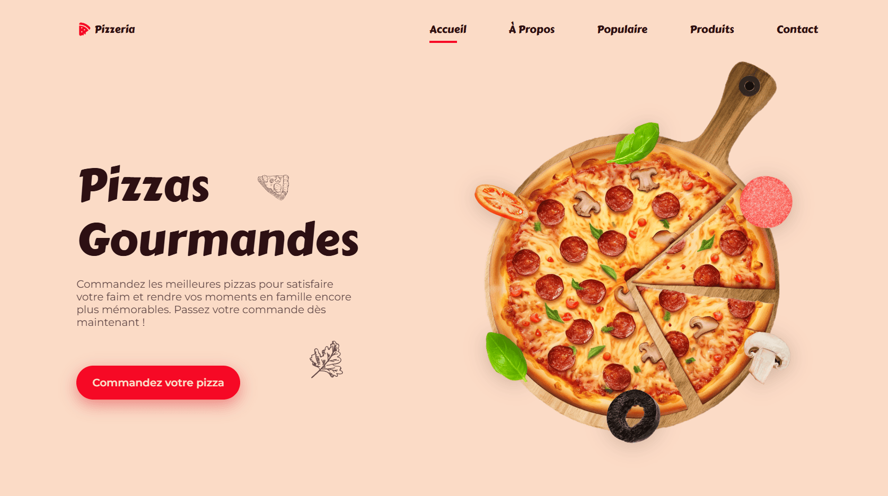

<div align="center">  
    <a href="https://pizzeria-paris.netlify.app/" target="_blank">  
        
    </a>  
  <h3 align="center">🍕 Pizzeria</h3>  
</div>

## <br /> 📌 Sommaire  

🎨 [**Introduction**](#-introduction)<br />
🛠️ [**Technologies**](#️-technologies)<br />
🚀 [**Installation**](#-installation)<br />   

## <br /> 🎨 Introduction  

Création d'une landing page moderne et minimaliste pour un restaurant de pizza, développée en **HTML**, **CSS** et **JavaScript**. Enrichie d'animations fluides grâce à **ScrollReveal.js.**

## <br /> 🛠️ Technologies  

⚡ **HTML** &nbsp;&nbsp; 
🎨 **CSS** &nbsp;&nbsp; 
💡 **JavaScript** &nbsp;&nbsp;
🎬 **ScrollReveal.js**

## <br /> 🚀 Installation  

### ✅ Pré-requis  

🛠️ [**Git**](https://git-scm.com/) &nbsp;&nbsp; 
🔧 [**Node.js**](https://nodejs.org/fr) &nbsp;&nbsp; 
📦 [**npm**](https://www.npmjs.com/)  

### 📥 Cloner le projet  

```bash
git clone git@github.com:ValentinMadiot/pizza-restaurant_ui.git
```

### ▶️ Lancer le projet
Utilisez Live Server pour un rechargement en temps réel.